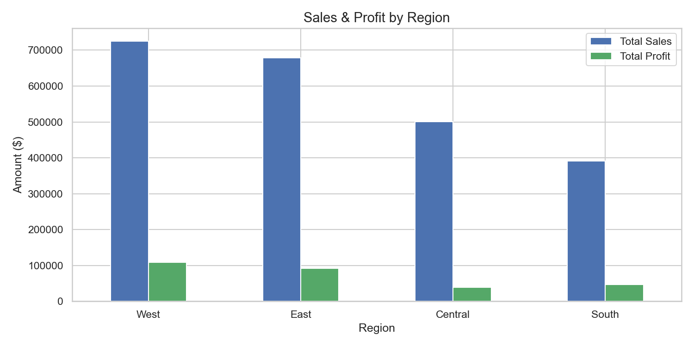

# Superstore Sales Analysis

## Project Overview
End-to-end sales analysis on 9,994 orders from a US retail superstore 
to identify revenue trends, profitability issues, and key business insights.

## Tools Used
- Python (Pandas, Matplotlib, Seaborn)
- SQL (SQLite)
- Power BI
- Jupyter Notebook

## Key Business Insights
- West region leads in both sales ($725K) and profit ($108K)
- Furniture category has only 2.49% profit margin despite $741K in sales
- 18.72% of all orders are loss-making
- Binders are the most loss-making sub-category (-$38,510)
- Business grew 51% from 2014 to 2017

## Project Structure
- `Superstore-Sales-Analysis/data/` — raw and cleaned datasets
- `Superstore-Sales-Analysis/charts/` — all visualizations
- `Superstore-Sales-Analysis/dashboard/` — Power BI dashboard
- `superstore_sales_analysis.ipynb` — complete analysis notebook

## Dashboard Preview

